# brand-identity

[](https://github.com/fatihaydost/brand-identity-skill/actions/workflows/test.yml)
[](LICENSE)

A skill for Claude Code that designs a brand identity as one system: **logo, typography and colour palette built
together from one idea**, measured, shown side by side as identity cards, and handed over as a brand guidelines kit
for the set you pick.

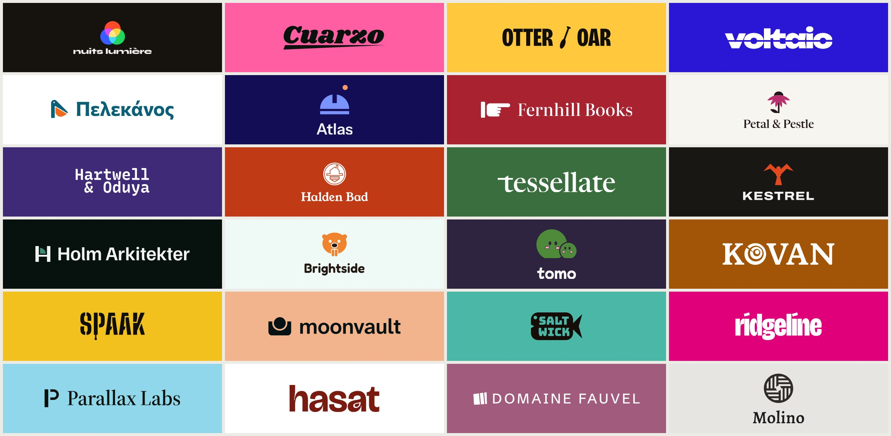

<sub>Twenty-four briefs, one direction shown from each: a light festival in Lyon, a taquería in Mexico City, a
pharmacy in Athens, a techno label in Berlin, a floating sauna in Oslo, a children's dentist, a weeding-robot
start-up, a honey co-op on the Black Sea and more. Mascots, emblems, monograms, stencils and plain wordmarks; every
mark, typeface and colour above came out of a run of this skill.</sub>

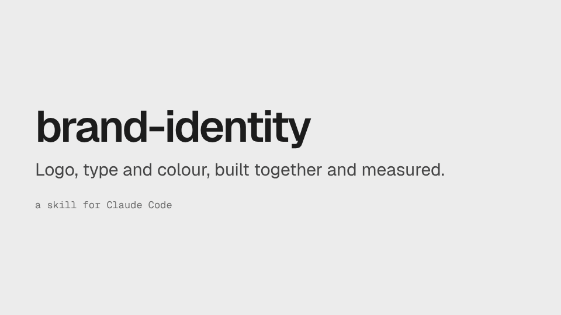

**[What you get](#what-you-get)** · **[Examples](#examples)** · **[Install](#install)** · **[Use](#use)** ·
**[How it works](#how-it-works)** · **[Network and privacy](#network-and-privacy)** · **[Develop](#develop)**

## What you get

- **Three (up to four) identity sets**, each built around a single mechanism that produces the mark, the type choice
  and the palette at once, so the parts belong together instead of being picked separately.
- **Measured, not asserted.** Contrast (WCAG 2 and APCA), colour-blindness simulation, glyph coverage for the
  languages the brand writes in, font licences, tabular figures, and the logo rendered at 16 and 32 px. A failed
  measurement is a gate the set must pass; a heuristic is labelled as a warning; taste is labelled as judgement.
- **Sets that don't look like every other AI brand.** The skill knows what plain models reach for and asks for a
  reason from the brief whenever a set uses it ([below](#why-the-sets-dont-look-like-every-other-ai-brand)).
- **A brand guidelines kit** for the chosen set: an 8-page PDF (cover, idea, logo, variations, logo on colour and
  misuse drawn for *this* mark, colours, typography, applications; `--full` adds grid, dark mode, accessibility,
  iconography and imagery for 13), logo files (SVG and PNG: full colour, one colour, reversed, app icon, favicon), design tokens (CSS,
  SCSS, Tailwind, DTCG JSON) and a font sheet with embed code.
- **Your site, restyled.** Give it a URL and it reads the current logo, type and colours, then previews each set on
  your own pages. Keep the parts you like (`keep`), evolve others (`refresh`).
- **Any part on its own**: just a logo, just a type system, a palette for an existing logo, or a critique of an
  identity you already have.

## Examples

### Fernhill Books: an independent bookshop and small press in Edinburgh

*Brief: literate, unhurried, wry. Competitors: a national chain in navy and white, a second-hand shop with a gilt
sign, an online marketplace.*

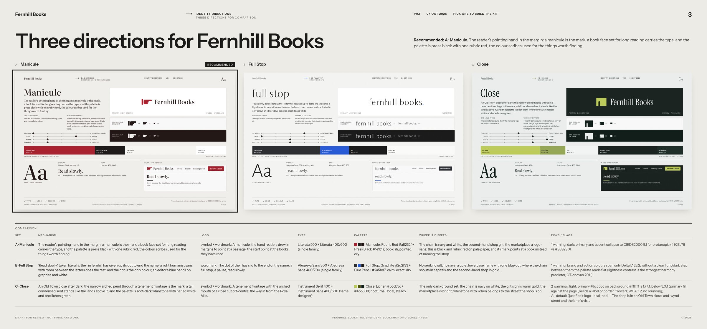

**A · Manicule** (recommended, picked): the pointing hand readers drew in margins is the mark, Literata carries both
display and text, and the palette is press black with one rubric red. **B · Full Stop**: a quiet lowercase name that
ends on a blue proofreader's full stop. **C · Close**: an Old Town passage under a tenement, on a dark ground.

| Kit: cover | Kit: typography |
|---|---|
| 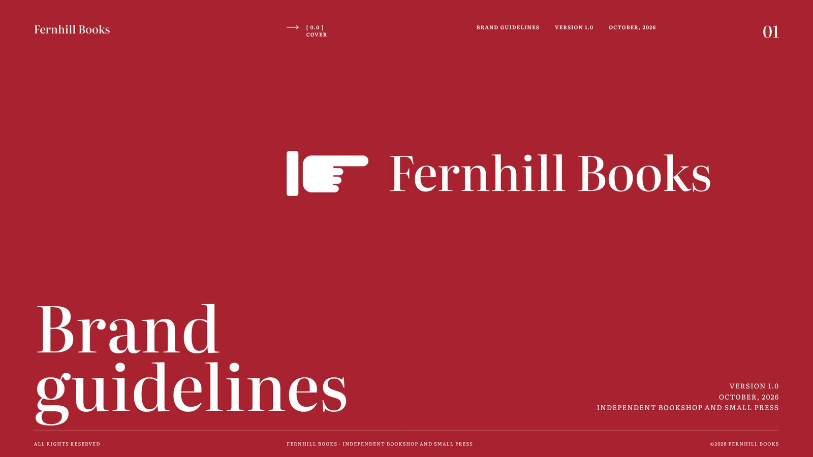 | 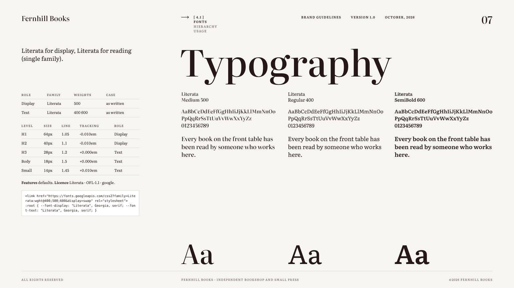 |

### Tessellate: an open-source data pipeline orchestrator

*Brief: precise, calm, candid; the product shows run times and costs, so figures must be tabular. Competitors: an
established scheduler with a pinwheel logo, two start-ups in purple and teal.*

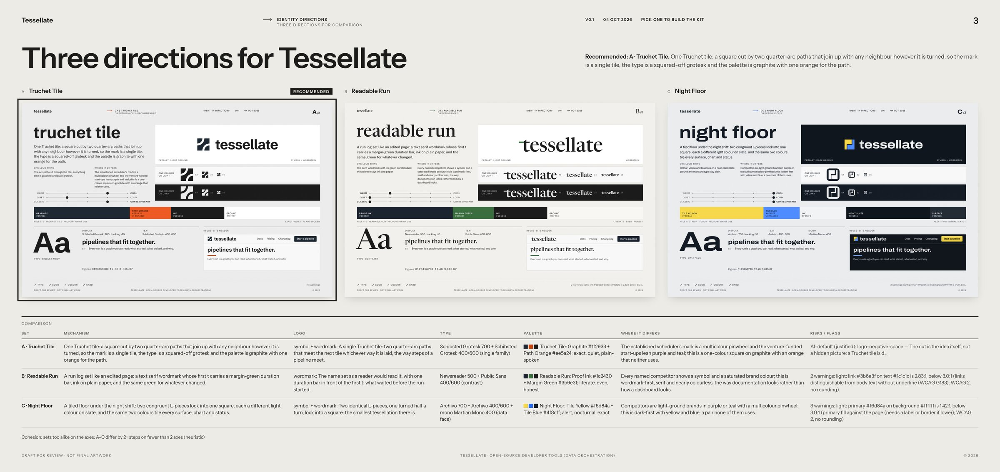

**A · Truchet Tile** (recommended, picked): one tile cut by two quarter arcs that join any neighbour however it is
turned, the way steps of a pipeline meet. **B · Readable Run**: a text serif wordmark whose first *t* carries a
duration bar. **C · Night Floor**: two L-pieces lock into one square, dark-first.

| Kit: logo on colour, and misuse specific to this mark | Kit: applications |
|---|---|
| 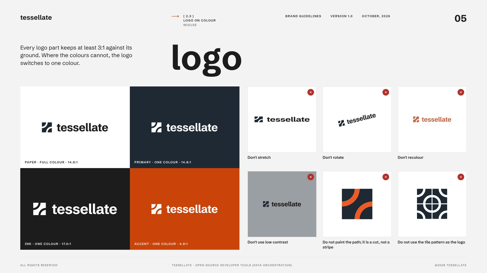 | 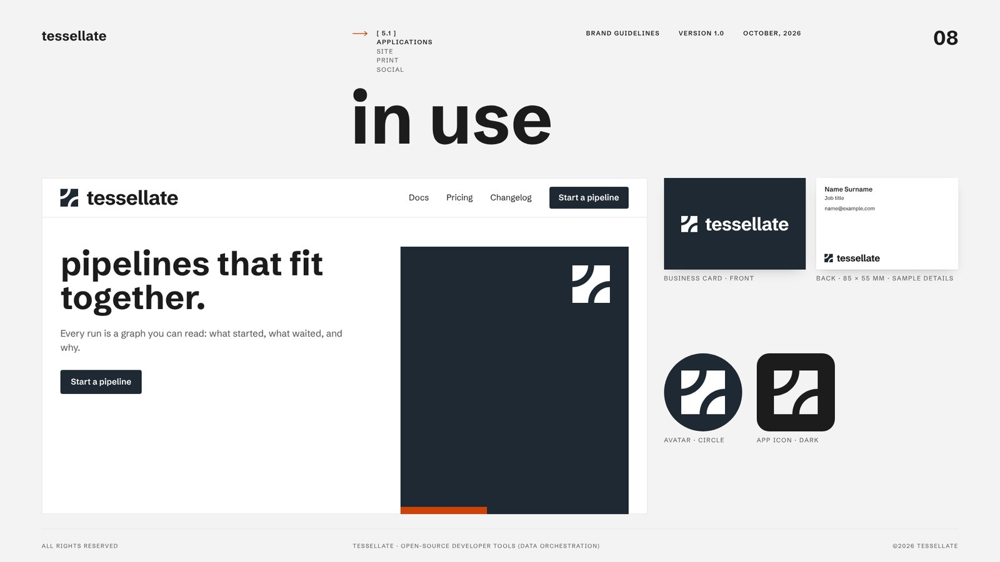 |

### More runs

| Brief | Languages | Directions (recommended first) |
|---|---|---|
| 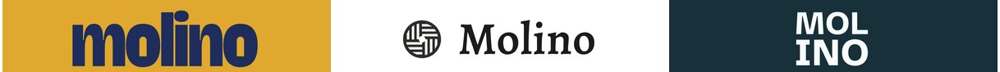 **Molino Coffee**, a specialty coffee shop in Lisbon | en, pt | Vizinho · Mó · Bloco |
| 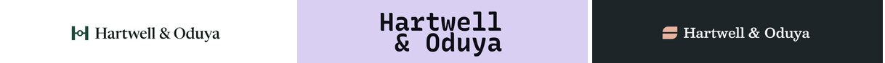 **Hartwell & Oduya**, a commercial law firm in London | en | The Bar Between · Equal Measure · Counterparts |
|  **Parallax Labs**, AI planning agents for supply chains | en | Depth Field · Parallax Error · Computation Pad |
| 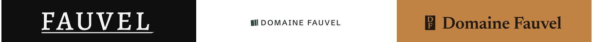 **Domaine Fauvel**, a natural wine estate in Burgundy | en, fr | La Taille · Climat · Fauve |
| 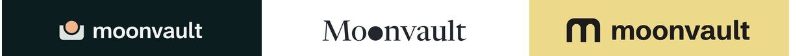 **Moonvault**, a self-custody crypto wallet | en | Held Moon · Two O's · Lamp Arcade |
| 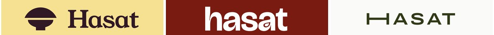 **Hasat**, a Turkish breakfast restaurant in Istanbul | tr, en | Tepeleme · Demli · Uzun Sofra |

## Install

**Claude Code plugin** (recommended):

```
/plugin marketplace add fatihaydost/brand-identity-skill
/plugin install brand-identity@brand-identity-skill
```

**Or as a plain skill:**

```bash
git clone https://github.com/fatihaydost/brand-identity-skill
mkdir -p ~/.claude/skills
ln -s "$PWD/brand-identity-skill/skills/brand-identity" ~/.claude/skills/brand-identity
```

**Requirements:** Python 3.10+, a Chromium-based browser (Chrome, Chromium, Edge or Brave) and, ideally,
[uv](https://docs.astral.sh/uv/). With uv the scripts install their own Python packages (fonttools, uharfbuzz,
skia-pathops) into a cached environment on first use; nothing to `pip install`. Run
`python3 skills/brand-identity/scripts/brand.py check` to see what is missing. Tested end to end on Linux, including
a clean container; unit tests run in CI on Linux, macOS and Windows.

**Other hosts.** The skill is a standard `SKILL.md` folder, so agents that read Agent Skills can load
`skills/brand-identity`; it is tested end to end in Claude Code. In claude.ai chat the code sandbox does not allow
Google Fonts by default, so type measurement and rendering fail there; use Claude Code.

## Use

Ask Claude Code in plain words:

- "Logo, fonts and colours for a specialty coffee roaster in Lisbon."
- "New type and palette for https://example.com, keep the logo."
- "Just a type system for my newsletter."
- "Critique our brand identity."

It asks one round of questions (what to make, how many sets, languages, competitors), builds the sets, shows the
board and **stops** for you to pick. It never picks for you. Then it builds the kit for your choice, or for a mix
("logo from A, palette from B").

A full run to the board takes about 40 agent turns and roughly 0.9 M billed-input-equivalent tokens (measured on six
briefs; see [testing](docs/testing.md#budget)).

## Why the sets don't look like every other AI brand

Asked for a brand identity, plain models converge: cream ground, terracotta, a gold accent, Fraunces headings, Inter
body text, a logo that hides a letter in a circle. The skill knows these defaults and asks for a reason from the
brief whenever a set uses one; at least one set per run uses none. On the same six briefs:

| | AI-default hits (type and palette) | sets with none |
|---|---|---|
| Plain model, 24 answers | 4.38 per answer | 0 of 24 |
| brand-identity, 18 sets | 0.28 per set | 13 of 18 |

Method and data: [`docs/testing.md`](docs/testing.md#ai-defaults).

## How it works

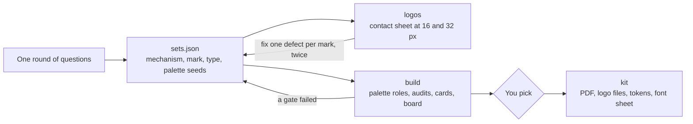

The agent designs; the scripts measure. Gates (contrast, licence, glyph coverage, file validity, renders) stop a set
until it is fixed; warnings are heuristics and say so. Architecture: [`docs/architecture.md`](docs/architecture.md).
Tests (unit, smoke, rendered-output probes, end-to-end runs): [`docs/testing.md`](docs/testing.md).

## Network and privacy

The skill runs locally. It contacts:

- **Google Fonts** (`fonts.googleapis.com`, `fonts.gstatic.com`) and the
  [google/fonts](https://github.com/google/fonts) repository on `raw.githubusercontent.com`, to download fonts and
  their metadata and licences for measurement and rendering;
- **PyPI**, through uv, once, for its Python packages;
- **your site and the competitor sites you name**, opened in a headless browser, only when you give their URLs.

No telemetry; nothing is uploaded. The brand's fonts are never subset or redistributed: the kit links to them and
gives embed code. Licences are checked per family (OFL by default; Fontshare and commercial faces get a licence note).

## Develop

```bash
pip install -r requirements-dev.txt     # requirements.txt + gflanguages (checks the bundled language data)
python3 -m unittest discover -s tests
python3 tools/smoke_test.py
python3 tools/package_skill.py          # dist/brand-identity.zip
```

```
skills/brand-identity/   the skill: SKILL.md, references/, scripts/, templates/, assets/
tools/                   smoke test, packager, run measurement, AI-defaults experiment, catalogue builders
tests/                   unit tests
evals/                   behaviour evals and fixtures
docs/                    architecture, testing, images
```

## Licence

MIT, see [LICENSE](LICENSE). Adapted code and bundled data: [THIRD_PARTY_NOTICES.md](THIRD_PARTY_NOTICES.md). Brand
names and measured site colours belong to their owners: [TRADEMARKS.md](TRADEMARKS.md). The example briefs in this
README were invented for it; any likeness to a real business is coincidental.
